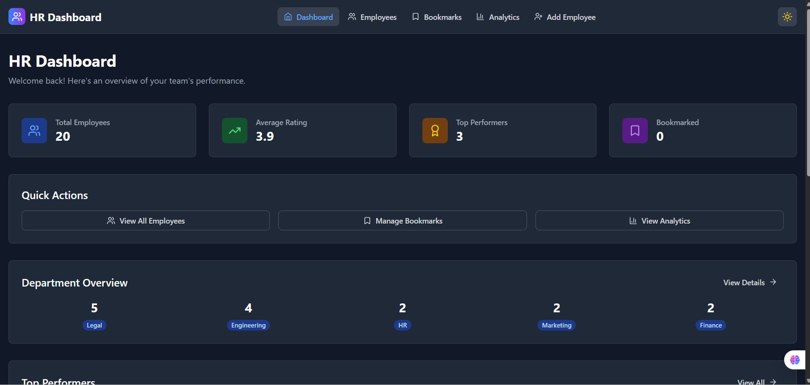
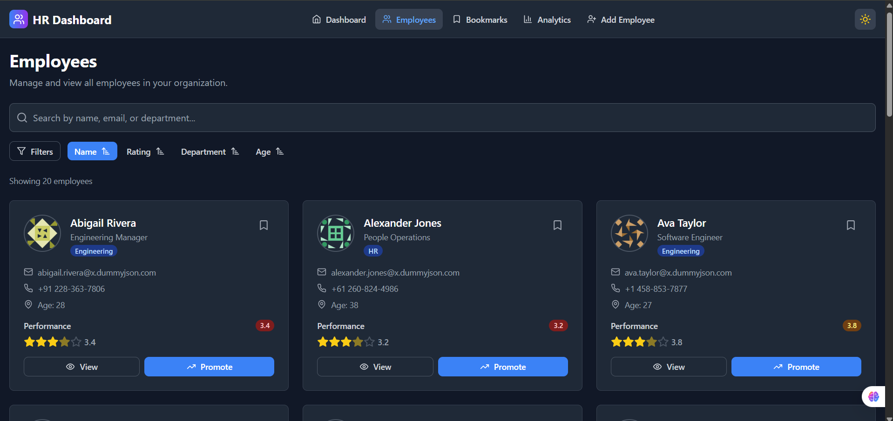
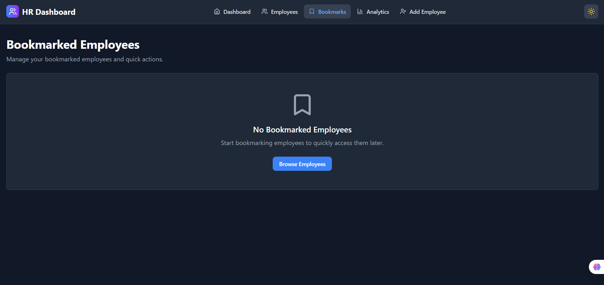
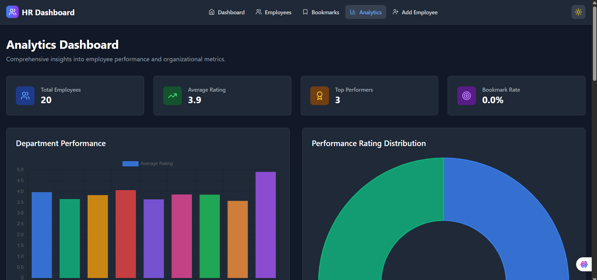
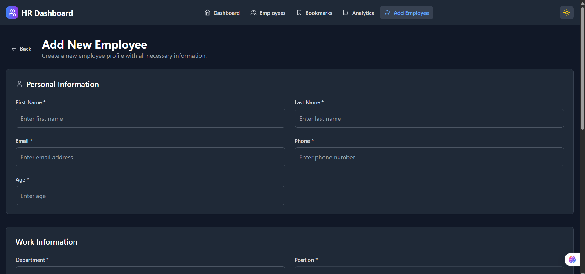

# 💼 HR Performance Dashboard (Advanced)

A modern, responsive HR Management Dashboard built with Next.js App Router, Tailwind CSS, and React, designed for HR managers to monitor employee performance, manage bookmarks, and gain analytical insights.

## 🔧 Tech Stack

- ⚛️ **Framework:** React.js (App Router – Next.js 13+)
- 🎨 **UI Library:** Tailwind CSS
- 💻 **Language:** JavaScript (ES6+)
- 📦 **State Management:** Zustand / React Context API
- 🔄 **Data Fetching:** Client-side & Server-side (Hybrid)

### ✨ Optional Integrations
- 📊 Chart.js (Analytics)
- 🔐 NextAuth.js (Authentication)
- 🎞️ Framer Motion (Animations)

## 🚀 Live Demo

🔗 View Live Demo – https://endearing-scone-cba381.netlify.app

## ✨ Core Features

- ✅ **Dashboard Homepage** - Employee cards with ratings, search, and filter
- ✅ **Advanced Search** - Search by name, email, or department (case-insensitive)
- ✅ **Multi-Select Filters** - Filter by department and performance rating
- ✅ **Dynamic Employee Details** - Detailed profiles with tabbed interface
- ✅ **Bookmark System** - Save and manage favorite employees
- ✅ **Analytics Dashboard** - Visual insights with Chart.js
- ✅ **Dark/Light Mode** - Theme toggle with persistence
- ✅ **Responsive Design** - Mobile-first approach, works on all devices
- ✅ **State Management** - Zustand for global state with persistence
- ✅ **Custom Hooks** - Reusable logic for bookmarks and search

## 📸 Screenshots

<details>
<summary>View Screenshots</summary>


### Dashboard HomePage View

<br>Main dashboard showing employee cards with performance ratings and quick actions

### Search & Filter

<br>Advanced search and filtering capabilities by name, department, and performance rating

### Bookmark

<br> Bookmark system for saving and managing favorite employees

### Analytics Dashboard

<br>Visual analytics with performance metrics and department insights

### Add Employee

<br>Employee registration form with validation and input management

</details>

## 📌 Technical Architecture

### 🧱 Frontend Architecture
- Next.js App Router with dynamic/nested routes
- Hybrid data fetching (CSR + SSR)
- Reusable UI components with Tailwind CSS

### 🗂️ State Management
- Global state via Zustand or Context API
- Persistent storage for bookmarks and theme preferences

### 🧩 Custom Hooks
- `useBookmarks` - Manage saved employees
- `useSearch` - Debounced search & filters
- `useTheme` - Dark/Light mode toggle

### 🎨 UI/UX Features
- Dark/Light mode toggle
- Responsive design for all screen sizes
- Accessibility support (ARIA labels, keyboard navigation)
- Smooth animations and transitions

### 📈 Analytics
- Chart.js integration for performance metrics
- Department-wise insights
- Bookmark trends visualization

### 📚 Routing Structure
```
/                    # Dashboard homepage
/employee/[id]       # Dynamic employee details
/bookmarks          # Saved employees
/analytics          # Performance insights
```

## 🚀 Quick Start

### Prerequisites
- Node.js 18.0 or later
- npm or yarn

### Installation

1. **Clone the repository**
   ```bash
   git clone https://github.com/your-username/hr-dashboard.git
   cd hr-dashboard
   ```

2. **Install dependencies**
   ```bash
   npm install
   # or
   yarn install
   ```

3. **Run the development server**
   ```bash
   npm run dev
   # or
   yarn dev
   ```

4. **Open in browser**
   Navigate to [http://localhost:3000](http://localhost:3000)

### Build for Production

```bash
npm run build
npm start
```

## 🎯 Usage Guide

### 📊 Dashboard Navigation
- Switch between different views using the top navigation bar
- Toggle dark/light mode with the theme switch in the header

### 👨‍💻 Employee Management
- **Search:** Find employees by name, email, or department (case-insensitive)
- **Filter:** Filter by department and performance rating
- **View Details:** Click "View Details" on any employee card
- **Bookmark:** Save employees for quick access
- **Actions:** Promote employees or assign to projects

### 🔖 Bookmarks
- Access your bookmarked employees at `/bookmarks`
- Remove individual bookmarks or clear all at once
- Quick actions available for bookmarked employees

### 📈 Analytics Dashboard
- View department-wise performance metrics
- Monitor average rating trends
- Track bookmark usage patterns

## 📁 Project Structure

```
hr-dashboard/
├── app/                    # Next.js App Router
│   ├── employee/[id]/     # Dynamic employee routes
│   ├── bookmarks/         # Bookmarks page
│   ├── analytics/         # Analytics dashboard
│   └── layout.js          # Root layout
├── components/            # Reusable UI components
│   ├── ui/               # Base UI components
│   ├── dashboard/        # Dashboard-specific components
│   └── forms/            # Form components
├── hooks/                # Custom React hooks
├── lib/                  # Utility functions
├── store/                # Zustand store configuration
└── public/               # Static assets
```

## 🛠️ Available Scripts

| Script | Description |
|--------|-------------|
| `npm run dev` | Start development server |
| `npm run build` | Build for production |
| `npm run start` | Start production server |
| `npm run lint` | Run ESLint |
| `npm run lint:fix` | Fix ESLint issues |

## 🔮 Future Enhancements

### Phase 1 - Testing & Quality
- [ ] Unit & Integration Testing with Jest and React Testing Library
- [ ] E2E testing with Playwright or Cypress
- [ ] Code coverage reports

### Phase 2 - Advanced Features
- [ ] Role-Based Access Control (RBAC)
- [ ] Admin panel for system management
- [ ] Advanced filtering options (tenure, project history)
- [ ] Export functionality (PDF, CSV)

### Phase 3 - Scale & Performance
- [ ] Internationalization (i18n) support
- [ ] Table view toggle option
- [ ] Real-time notifications
- [ ] Performance optimization and lazy loading

## 🤝 Contributing

We welcome contributions! Please follow these steps:

1. Fork the repository
2. Create your feature branch (`git checkout -b feature/AmazingFeature`)
3. Commit your changes (`git commit -m 'Add some AmazingFeature'`)
4. Push to the branch (`git push origin feature/AmazingFeature`)
5. Open a Pull Request

### Development Guidelines
- Follow the existing code style and conventions
- Write meaningful commit messages
- Add tests for new features
- Update documentation as needed

## 📄 License

This project is licensed under the ISC License - see the [LICENSE](LICENSE) file for details.

## 👏 Acknowledgments

- [DummyJSON](https://dummyjson.com/) for providing mock user data
- [Chart.js](https://www.chartjs.org/) for beautiful charts
- [Tailwind CSS](https://tailwindcss.com/) for utility-first styling
- [Next.js](https://nextjs.org/) for the amazing framework
- [Zustand](https://github.com/pmndrs/zustand) for simple state management

## 📞 Support

If you have any questions or need help, please:
- Open an issue on GitHub
- Check the [documentation](./docs)
- Contact the maintainers

---

<div align="center">

**Built with ❤️ for the HR Dashboard Challenge**


</div>
